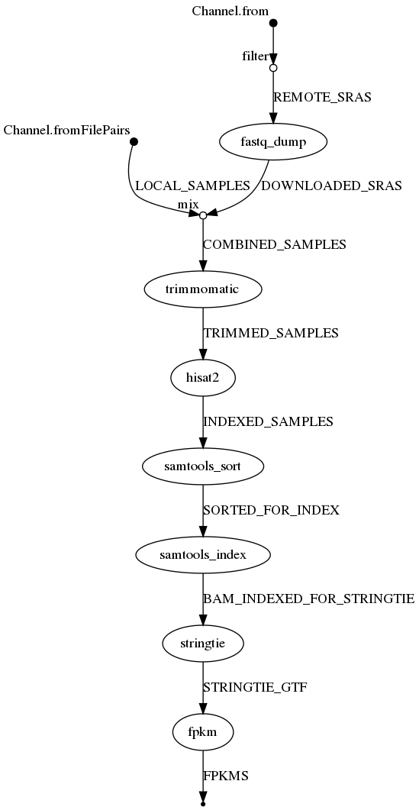
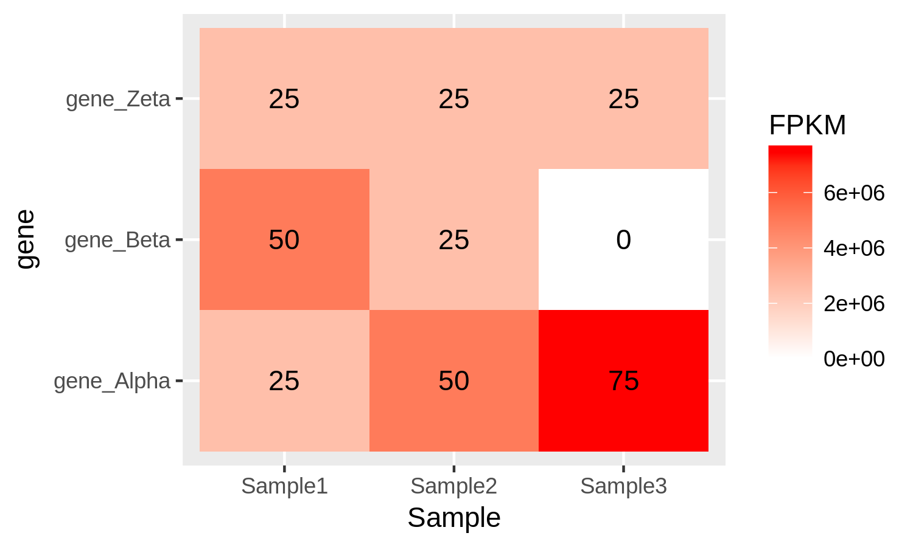

# GEM-maker

The GEM-maker project is a [NextFlow](https://www.nextflow.io/) workflow that generates a file containing FPKM values for all genes in a genome annotation set.
In other words, a Gene Expression Vector (GEV) for each sample is created. GEM-maker can automatically download these samples from [NCBI](https://www.ncbi.nlm.nih.gov/), or can operate on files that are stored locally.
This workflow combines the [sratoolkit](https://www.ncbi.nlm.nih.gov/books/NBK158900/), [FastQC](https://www.bioinformatics.babraham.ac.uk/projects/fastqc/), [Trimmomatic](http://www.usadellab.org/cms/?page=trimmomatic), [Hisat2](https://ccb.jhu.edu/software/hisat2/index.shtml), [Samtools](http://www.htslib.org/), and [StringTie](http://www.ccb.jhu.edu/software/stringtie/) software packages.
The workflow expects the Lua-based [Lmod](https://lmod.readthedocs.io/en/latest/) software module system is installed with each software described above, making them available via the module system.
The GEM-maker workflow is setup to work with Illumina RNA-seq datasets.
It is intended to be run on a high-performance compute cluster.

For testing purpose, or for execution of a small dataset (or large dataset if sufficient storage is available), a Docker image is available that contains all of the necessary software components: https://github.com/SystemsGenetics/GEM-maker-docker

Note: The GEM-maker worflow is not configured to use Hisat2/Stringtie to identify novel splice varients or gene models.
It uses the existing predicted gene models as provided with the assembly annotation.



---


## Prepare the Workflow

Clone this workflow project into a working directory.
As with all NextFlow workflows, you can configure the behavior of the workflow by creating a **nextflow.config** file.
The GEM-maker workflow provides an example file you can use to get started.

To clone the workflow into a directory:
```bash
nextflow clone SystemsGenetics/GEM-maker target-dir
```

---

## Test using the example data

GEM-maker comes with two examples **Local Example** and **Remote Example**

To execute the GEM-maker with an example dataset you must first rename the **nextflow.config.example** file as **nextflow.config**.

You should then ensure that the **trimmomatic.clip_path** option in the **nextflow.config** file is set to the full path where the Trimmomatic clipping files are housed.  Replace the text **<ILLUMINACLIP_PATH>** placeholder text with the path.

The example config file also has an example profile for running this workflow on a SLURM cluster. To use the SLURM profile you must, at a minimum, change the **<QUEUE_NAME>** placeholder text to be the name of the queue used for submission on your cluster.  If you require additional settings you can adjust the profile as per the [NextFlow configuration documentation](https://www.nextflow.io/docs/latest/config.html#config-profiles).

### Local Example

GEM-maker comes with a Local example dataset, which is stored in the **examples** folder. The **nextflow.config.example** (which should be renamed **nextflow.config** to run the example) is set up to run this data when you clone the repository.

 The data is from an imaginary organism with the name of "Cool Organism", which is abbreviated "CORG". CORG has a very small "genome" of only 1471 nucleotides, 2 "chromosomes" and 3 "genes". The 3 genes are named "gene\_Alpha", "gene\_Beta" and "gene\_Zeta". The made up reference genome file **CORG.fna**, gtf file **CORG.gtf**, and hisat files **CORG.?/ht2** are stored in the directory "./GEM-maker/examples/reference/".

The example data consists of 3 "RNA-seq" data sets which are contained in the directory "./GEM-maker/examples/Data/". They are examples of unpaired data, and are each in a folder of their own. The file format for these reads is "?\_1.fastq" where the "?" is replaced by the number of the sample. GEM-maker finds these files through the glob pattern assigned to the "local\_samples\_path" in the **nextflow.config** file.

Once you understand the above information, run the Local example dataset using the commands in the section below that is titled **Executing the Workflow**

Once executed, the local example should output 3 directories. GEM-maker will automatically combine files that have the same experiment number( \[SED\]RX0000000 ) but different run numbers ( \[SED\]RR0000000 ), so it is possible that the \[SED\]RX number contains multiple \[SED\]RR runs. However, in the the local example, this is not the case.

In each output directory you will find the following files:
- **fastq**   The fastq reads file for the experiment
- **fastqc**  6 or 12 files (depending on paired or unpaired data) from fastqc. Fastqc is set up to check files before and after trimmomatic
- **sam**  alignment file
- **bam**   binary alignment file
- **ga**  expression level transcript abundance
- **fpkm**  2 column version of **ga** file with only gene and fpkm value

#### After the workflow

The output of GEM-maker can be used for several different analysis. The FPKM files can be combined into an expression matrix and then visualized using a heatmap. The following heatmap is the Local Example's fpkm values divided by 1000 in heatmap form. We can see that gene_Zeta remained constant across all three samples, gene_Beta decreased, and gene_Alpha increased.



### Remote Example
If you wish to use GEM-maker to download all or some of your fastq files from NCBI, you would also need to include an REMOTE\_IDs.txt file. An example of such a file is located in "./GEM-maker/examples/". You can point GEM-maker to this list by modifying the "remote\_list\_path" parameter in the "nextflow.config" file.

See the **README.md** in the "/examples/" directory for more information about running the remote example.

---

## Test using your own data.

To prepare your own samples for execution you must peform the following:

- As with the example data set described above, you must edit the **netxflow.config** file and set the **trimmomatic.clip_path** and customize it for execution on a cluster if desired.

- For local files, identify a glob pattern that you can add to the **nextflow.config** file that will identify these files.

- For files on NCBI, Identify in NCBI SRA the fastq_run_ids of the SRA samples you want to analyze.
  fastq_run_id numbers typically start with an SRR, ERR or DRR prefix.
  These sample run IDs must be placed, one per line, in a REMOTE_IDS.txt file.
  These will be downloaded automatically by the program.

- Download the genome annotation/reference files.
  You must have the following:

  - A FASTA file containing the full genomic sequence (either pseudomolecules or scaffolds). Note, if your genome file is extremely large with hundreds of thousands of contigs/scaffolds, you may want to reduce the size of the FASTA file to contain only those contigs/scaffolds with predicted annotated genes.

  - A GTF file containing the gene models. Sometimes a genome assembly does not provide a GTF file, but rather provides a GFF file. You can convert the GFF file to a GTF file using the **gffread** program of [cufflinks](http://cole-trapnell-lab.github.io/cufflinks/file_formats/), which you may have to download separately.

  - You must have hisat2 index files of your genome sequence.
    These are constructed by using the **hast2-build** command.

  - Make sure that your GTF file has the exact same prefix as the hisat2 index files.

  - All of the genome annotation files must be in a directory and this directory must be identified in the **nextflow.config** file using the **ref** > **path** paramter.

- Finally, edit the **nextflow.config** file and change the **prefix** parameter to be the prefix used with **hisat2-build** when you created the index files.

As an example for a proper setup, you will notice that the GEM-maker project contains an **examples** directory and within the **examples/reference** directory all of the files have the same prefix of **CORG**.
You'll also notice that this same value is set for the **prefix** in the nextflow.config.example file.
The example directory also contains an REMOTE_IDS.txt file containing a list of SRA fastq_run_IDs.

Once your files are prepared, you can execute the workflow.

---

## Executing the Workflow

To execute the workflow on a local machine use this command:
```bash
nextflow run GEM-maker.nf -profile standard
```

To resume a workflow in the event of a failure:
```bash
nextflow run GEM-maker.nf -profile standard resume
```


---

## TODO:

- [ ] Update instructions.
- [ ] Comment the main nextflow script.
- [ ] Change the parameter to a `.txt` with a file per line.
- [ ] Format the trimmomatic options.
