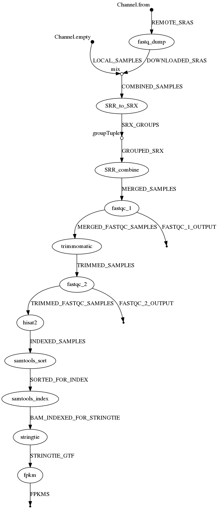

# sra2gev

The sra2gev project is a [NextFlow](https://www.nextflow.io/) workflow that downloads a set of samples from the NCBI Short Read Archive (SRA) and generates a file containing FPKM values for all genes in a genome annotation set.
In other words, a Gene Expression Vector (GEV) for each sample is created.
This workflow combines the [sratoolkit](https://www.ncbi.nlm.nih.gov/books/NBK158900/), [FastQC](https://www.bioinformatics.babraham.ac.uk/projects/fastqc/), [Trimmomatic](http://www.usadellab.org/cms/?page=trimmomatic), [Hisat2](https://ccb.jhu.edu/software/hisat2/index.shtml), [Samtools](http://www.htslib.org/), and [StringTie](http://www.ccb.jhu.edu/software/stringtie/) software packages.
The workflow expects the Lua-based [Lmod](https://lmod.readthedocs.io/en/latest/) software module system is installed with each software described above available via the module system.
The sra2gev workflow is setup to work with Illumina RNA-seq datasets housed in the SRA.
It is intended to be run on a high-performance compute cluster.

For testing purpose, or for execution of a small dataset (or large dataset if sufficient storage is available), a Docker image is available that contains all of the necessary software components: https://github.com/SystemsGenetics/sra2gev-docker

Note: The sra2gev worflow is not configured to use Hisat2/Stringtie to identify novel splice varients or gene models.
It uses the existing predicted gene models as provided with the assembly annotation.



---


## Prepare the Workflow

Clone this workflow project into a working directory.
As with all NextFlow workflows, you can configure the behavior of the workflow by creating a **nextflow.config** file.
The sra2gev workflow provides an example file you can use to get started.  Rename this example to get started:

To clone the workflow into a directory:
```bash
nextflow clone SystemsGenetics/sra2gev target-dir
```


### Test using the example data

To execute the sra2gev with the example dataset you must ensure that the **trimmomatic.clip_path** option is set to the full path where the Trimmomatic clipping files are housed.  Replace the text **<ILLUMINACLIP_PATH>** placeholder text. The example config file also has an example profile for running this workflow on a SLURM cluster. To use the SLURM profile you must, at a minimum, change the **<QUEUE_NAME>** placeholder text to be the name of the queue used for submission on your cluster.  If you require additional settings you can adjust the profile as per the [NextFlow configuration documentation](https://www.nextflow.io/docs/latest/config.html#config-profiles).

Sra2gev comes with example data, which is stored in the example folder. The "nextflow.config" is set up to run this data when you clone the repository. The data is from an imaginary oraganim (name of "Cool Organims" abbreviated "CORG") that has a "genome" of 1471 nucleotides 2 "chromosomes" and 3 "genes". The 3 genes are named "gene\_Alpha", "gene\_Beta" and "gene\_Zeta". The made up reference genome file (CORG.fna), gtf file (CORG.gtf), and hisat files (CORG.?/ht2) are stored in the directory "./sra2gev/examples/reference/". Sra2gev finds these files through the parameters 
 
The example data consists of 3 "RNA-seq" data sets which are contained in the directory "./sra2gev/examples/Data/". They are examples of unpaired data, and are each in a folder of there own. The file format for these reads is "Sample?\_1.fastq" where the "?" is replaced by the number of the sample. Sra2gev finds these files through the glob pattern assigned to the "local\_samples\_path" in the "nextflow.config" file.

If you wish to use sra2gev to download all or some of your fastq files from NCBI, you would also need to include an SRA\_ID.txt file. An example of such a file is located in "./sra2gev/examples/". You can point sra2gev to this list by modifying the "sra\_list\_path" parameter in the "nextflow.config" file.

Run the example by having nextflow run the "main.nf" script. This is usually done by running "nextflow run main.nf". This may vary depending on if you are running nextflow on a server that has requirments for executing scripts.

The example should output 6 files, 2 for each example. Sra2gev will automatically combine files that have the same experiment number( \[SED\]RX0000000 ) but different run numbers ( \[SED\]RR0000000 ), so it is possible that the \[SED\]RX number contains multiple \[SED\]RR runs. In the example, this is not the case. 

In each SRX\_output file you will find the following files:
- **fastq** The fastq reads file for the experiment
- **fastqc** 6 or 12 files (depending on paired or unpaired data) from fastqc. Fastqc is set up to check files before and after trimmomatic
- **sam** alignment file
- **bam** binary alignment file
- **ga** expression level transcript abundance
- **fpkm** 3 column version of **ga** file with only gene and fpkm value

FPKM files can then be combined into an 


## Test using your own data.

To prepare your own samples for execution you must peform the following:

- As with the example data set described above, you must edit the netxflow config file and set the **trimmomatic.clip_path** and customize it for execution on a cluster if desired.

- For local files, identify a glob pattern that you can add to the "nextflow.config" file that will identify these files.

- For files on NCBI, Identify in NCBI SRA the Run IDs of the SRA samples you want to analyze.
  Run numbers tyipcally start with an SRR or DRR prefix.
  These sample run IDs must be placed, one per line, in the SRA_IDS.txt file.
  These will be downloaded automatically by the program.

- Download the genome annotation/reference files.
  You must have the following:

  - A FASTA file containing the full genomic sequence (either pseudomolecules or scaffolds). Note, if your genome file is extremly large with hundresd of thousands of contigs/scaffolds, you may want to reduce the size of the FASTA file to contain only those contigs/scaffolds with predicted annotated genes.

  - A GTF file containing the gene models. Sometimes a genome assembly does not provide a GTF file, but rather provides a GFF file. You can convert the GFF file to a GTF file using the **gffread** program of [cufflinks](http://cole-trapnell-lab.github.io/cufflinks/file_formats/), which you may have to download separately.

  - You must have hisat2 index files of your genome sequence.
    These are constructed by using the **hast2-build** command.

  - Make sure that your GTF file has the exact same prefix as the hisat2 index files.

  - All of the genome annotation files must be in a directory and this directory must be identified in the **nextflow.config** file using the **ref** > **path** paramter.

- Finally, edit the nextflow.config file and change the **prefix** parameter to be the prefix used with **hisat2-build** when you created the index files.

As an example for a proper setup, you will notice that the sra2gev project contains an **examples** directory and within the **examples/reference** directory all of the files have the same prefix of **GCA_002793175.1_ASM279317v1_genomic**.
You'll also notice that this same value is set for the **prefix** in the nextflow.config.example file.
The example diretory also contains an SRA_IDS.txt file containing a list of SRA run IDs.

One your files are preapred you can execute the workflow.

---


## Executing the Workflow

To execute the workflow on a local machine use this command:
```bash
nextflow run sra2gev.nf -profile standard
```

To resume a workflow in the event of a failure:
```bash
nextflow run sra2gev.nf -profile standard resume
```


---

## TODO:

- [ ] Update instructions.
- [ ] Comment the main nextflow script.
- [ ] Change the parameter to a `.txt` with a file per line.
- [ ] Format the trimmomatic options.
