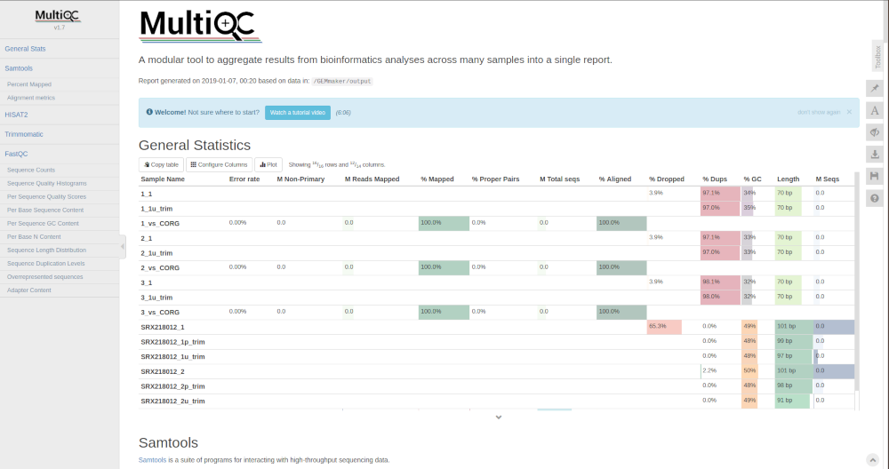
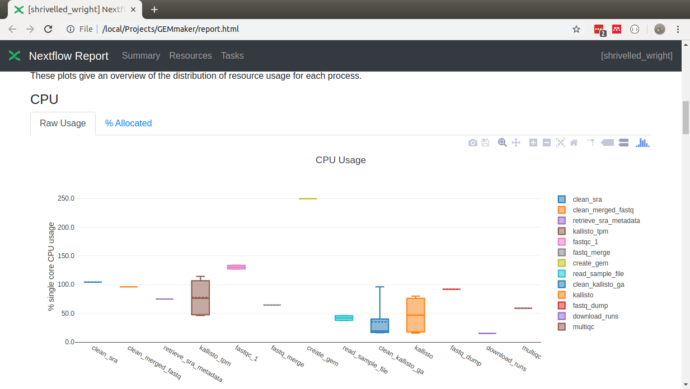
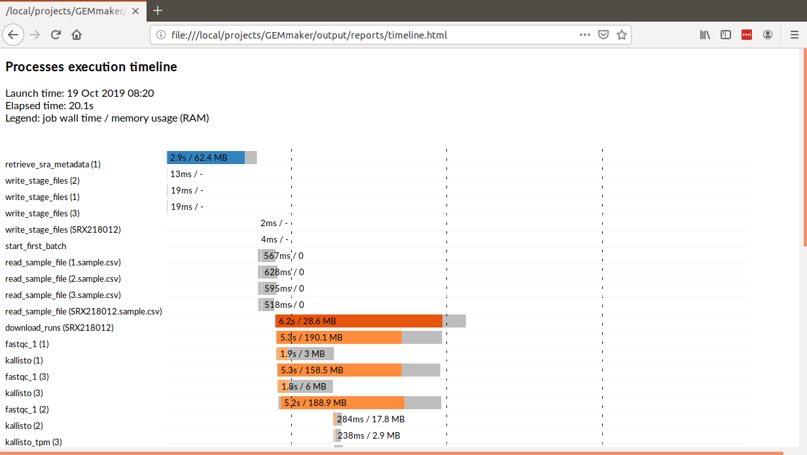

Step 6: Viewing and Finding Results
-----------------------------------

The Gene Expression Matrix (GEM)
````````````````````````````````
After GEMmaker completes, it will have created a Gene Expression Matrix (GEM) that can be found in the ``output/GEMs/`` directory by default. This directory contains the final gene-expression matrices in raw, TPM and FPKM form, depending on the tool used, and which output formats are enabled in ``nextflow.config``.

Sample files
````````````
As GEMmaker processes each RNA-seq sample, it creates a directory with all intermediate files that you indicated should be published in the ``nextflow.config`` configuration file. These can include the downloaded SRA or FASTQ files (if remote files are used), trimmed FASTQ files, SAM or BAM files (if Hisat2 is used), `FASTQC <https://www.bioinformatics.babraham.ac.uk/projects/fastqc/>`_ reports, and raw, FPKM or TPM output files (depending on the tool selected) .  These files are found withing the ``output`` folder of GEMmaker with each sample having its own directory.

The MultiQC report
``````````````````
The `MultiQC <http://multiqc.info>`__ tool is used as the last step in the GEMmaker workflow. It will examine the output files from each tool and  generate a report that allows you to examine the quality of the results.  You can find this report in the ``output/reports`` folder of GEMmaker. Please refer to the MultiQC website for how to use this report.  An example screenshot of a MultiQC report generated by GEMmaker is provided below.




Nextflow Reports
````````````````
GEMmaker will automatically request that Nextflow generate three reports: a summary report, a timeline report and a trace report.

Summary Report
''''''''''''''
The summary report is found in the ``ouptupt/reports`` folder of GEMmaker and is named ``report.html``.  You can open this file with a web browser to view it. It contains summary information such as graphs showing the amount of CPU and Memory (RAM) usage, Input/Output (I/O)
, job duration and a description of each task. The following screenshot shows the CPU usage section of the report from a run of the GEMmaker example data:



Timeline Report
'''''''''''''''
The timeline report shows the order and time required to execute each of the jobs launched by GEMmaker.  It is found in the ``output/reports`` folder of GEMmaker and is named ``timeline.html``. You can open this file with a web browser to view it. The following screenshot shows a section of the report from a run of the GEMmaker example data:



Trace Report
''''''''''''
The trace report is named ``trace.txt`` and is also found in the ``output/reports`` folder of GEMmaker. It contains the raw data used to create the Summary and Timeline reports.
